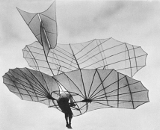

### picovideo

Drive short looping gif-like videos with the Raspberry Pi Pico microcontroller (RP2040) on small LCD displays. 
Working on Nokia-like 1.8" (160x128 px) LCD screens.

Supply video frames at command-line as a set of .png images. Compiles frames into a binary that is dropped onto Pico flash. Contains a compression algorithm that finds the optimum weave of images into blocks for compression with zlib.

Frame images should be prepared standardized to a screen size and for a desired framerate. 
Sample images are provided in the ./imgs directory.

   

Framerates up to 16.36 fps are possible.

Developed in collaboration with [Footnote Centre for Image and Text](http://footnotecentre.org/wp/), Belgrade.

---

## Installation

- System dependencies: bash python3 gcc make cmake zlib gcc-arm-none-eabi libnewlib-arm-none-eabi libstdc++-arm-none-eabi-newlib

- Libraries for python3: numpy matplotlib

- Install libprimed C library. 
[https://github.com/rpxpx/primed](https://github.com/rpxpx/primed)

- Install zlib for rp2xx. Library folder should be named zlib-rp2xx 
[https://github.com/kripton/zlib/tree/rp2xx](https://github.com/kripton/zlib/tree/rp2xx)

- Install Pico SDK. Library folder should be named pico-sdk, not e.g. pico-sdk-master 
[https://github.com/raspberrypi/pico-sdk](https://github.com/raspberrypi/pico-sdk)

- Install Wavepath Pico LCD libraries. Library folder should be named Pico_LCD_code 
[https://files.waveshare.com/upload/2/28/Pico_code.7z](https://files.waveshare.com/upload/2/28/Pico_code.7z) 
For technical info, see: [https://www.waveshare.com/wiki/Pico-LCD-1.8](https://www.waveshare.com/wiki/Pico-LCD-1.8)

- Optionally define directory constants for the above libraries in LIB_PATHS: 
  `LIBPRIMED_PATH=/path/to/libprimed` 
  `PICO_SDK_PATH=/path/to/pico-sdk` 
  `PICO_LCD_PATH=/path/to/Pico_LCD_code` 
  `ZLIB_RP2XX_PATH=/path/to/zlib-rp2xx`

---

## Usage

   `$ ./makevideo <framerate> <compression mode> [<overclock mode>] [<images>]`

Output appears in picovdeo as video.uf2. Copy this to Pico flash.

Compression modes: 
0: Raw data. Largest binary size, highest framerate. 
1: Single frame compression. 
2: Blokweave compression. Highest possible compression. Smallest binary, lowest framerate.

Overclock modes: 
0: Standard processor speed: 133 MHz [default] 
1: Overclock processor: 225 MHz

If no images are supplied as arguments, the images in the folder specified in IMGS_DIR will be used. If that folder is empty, or does not exist, the images in ./imgs will be used.
 
---
Maximum binary size is ~4.2MB, limited by available flash memory. Video compilation will fail if binary size would exceed this. Try higher compression, and then a smaller image set. In compression mode 0, 49 160x130 px frames can be compiled into video.

Highest possible framerate is 16.36 fps, in compression mode 0, and with overclocking on. When started, Pico will make a first pass through the image set to determine the maximum framerate for the binary. That framerate, and image decompression and render times, will be printed to screen for a few seconds. Pico will then loop through the frames at the requested rate, or the highest achievable rate if lower.

If the achievable rate is too low, try switching on processor overclocking. Overclocking consumes more power, and will deplete batteries faster.

**Max framerates (fps)**

|            |`0: 133 MHz`|`1: 225 MHz`|
|------------|------------|------------|
|`0: Raw`    |`15.30`     |`16.36`     |
|`1: SngleFr`|`12-13`     |`13-14`     |
|`2: BlokWv` |`7-8`       |`9-11`      |
